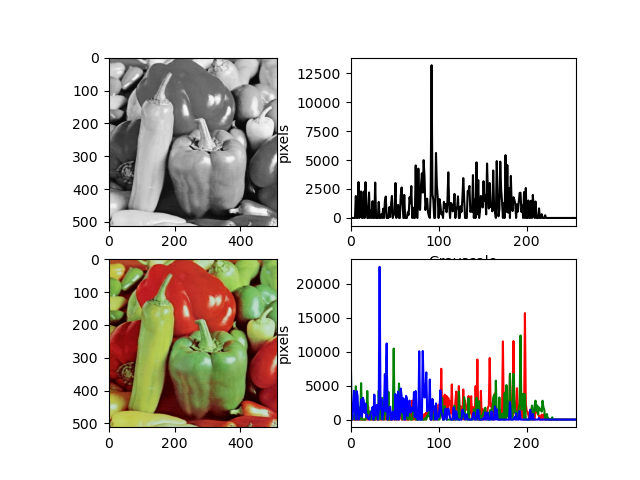
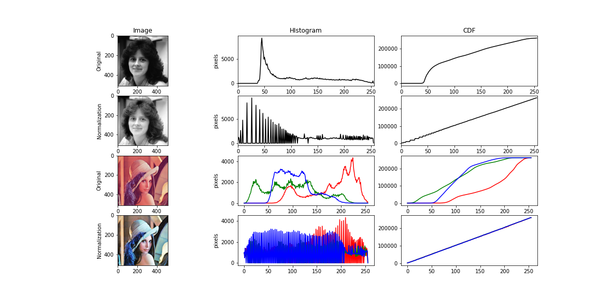
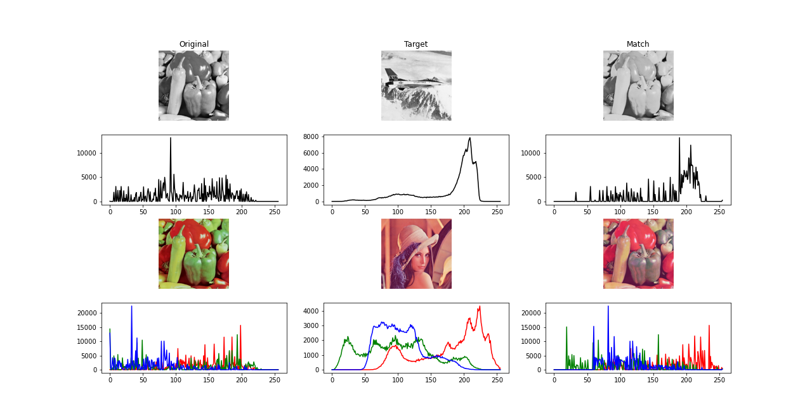

# Digital Image Processing using Numpy
## Structure

─Digital Image Processing using Numpy  
   │  examples.py  
   │  readme.md  
   │  
   ├─digitalimageprocesslib  
   │  └─ dipfunc.py  
   │  
   └─standard_test_images  
      └─  images.tif  
      
## Document
### **histfunc：functions to handle histogram**
* **calhist():** cacluate the histogram input image(both grayscale image color image)
``` python
   # read image
   img = cv2.imread("standard_test_images/peppers_gray.tif", cv2.IMREAD_GRAYSCALE) 
   img_color = cv2.imread("standard_test_images/peppers_color.tif")
   img_color = cv2.cvtColor(img_color, cv2.COLOR_BGR2RGB)

   # calculate histogram
   histogram = histfunc.calhist(img)
   histogram_color = histfunc.calhist(img_color)

    # figure was not shown here
```



* **cumsum():** calculate the cumulative distrubution function(only for single-channel image) 
* **histeq():** histogram equalization 
```python
   # grayscale image
    img = cv2.imread("standard_test_images/woman_darkhair.tif", cv2.IMREAD_GRAYSCALE)
    histogram = histfunc.calhist(img)
    cdf = histfunc.cumsum(img)
    
    img_norm = histfunc.histeq(img)
    histogram_norm = histfunc.calhist(img_norm)
    cdf_norm = histfunc.cumsum(img_norm)

    # color image
    img_color = cv2.imread("standard_test_images/lena_color_512.tif")
    img_color = cv2.cvtColor(img_color, cv2.COLOR_BGR2RGB)
    histogram_color = histfunc.calhist(img_color)
    cdf_color = np.zeros([256, 3])
    for k in range(3):
        cdf_color[:,k] = histfunc.cumsum(img_color[:,:,k])
        
    img_color_norm = histfunc.histeq(img_color)
    histogram_color_norm = histfunc.calhist(img_color_norm)
    cdf_color_norm = np.zeros([256, 3])
    for k in range(3):
        cdf_color_norm[:,k] = histfunc.cumsum(img_color_norm[:,:,k])
```


* **histnorm():** histogram normalization 
  ```python
    # grayscale image
    img = cv2.imread("standard_test_images/woman_darkhair.tif", cv2.IMREAD_GRAYSCALE)
    histogram = histfunc.calhist(img)
    cdf = histfunc.cumsum(img)
    
    img_norm = histfunc.histeq(img)
    histogram_norm = histfunc.calhist(img_norm)
    cdf_norm = histfunc.cumsum(img_norm)

    # color image
    img_color = cv2.imread("standard_test_images/lena_color_512.tif")
    img_color = cv2.cvtColor(img_color, cv2.COLOR_BGR2RGB)
    histogram_color = histfunc.calhist(img_color)
    cdf_color = np.zeros([256, 3])
    for k in range(3):
        cdf_color[:,k] = histfunc.cumsum(img_color[:,:,k])
        
    img_color_norm = histfunc.histeq(img_color)
    histogram_color_norm = histfunc.calhist(img_color_norm)
    cdf_color_norm = np.zeros([256, 3])
    for k in range(3):
        cdf_color_norm[:,k] = histfunc.cumsum(img_color_norm[:,:,k])
  

  ```

